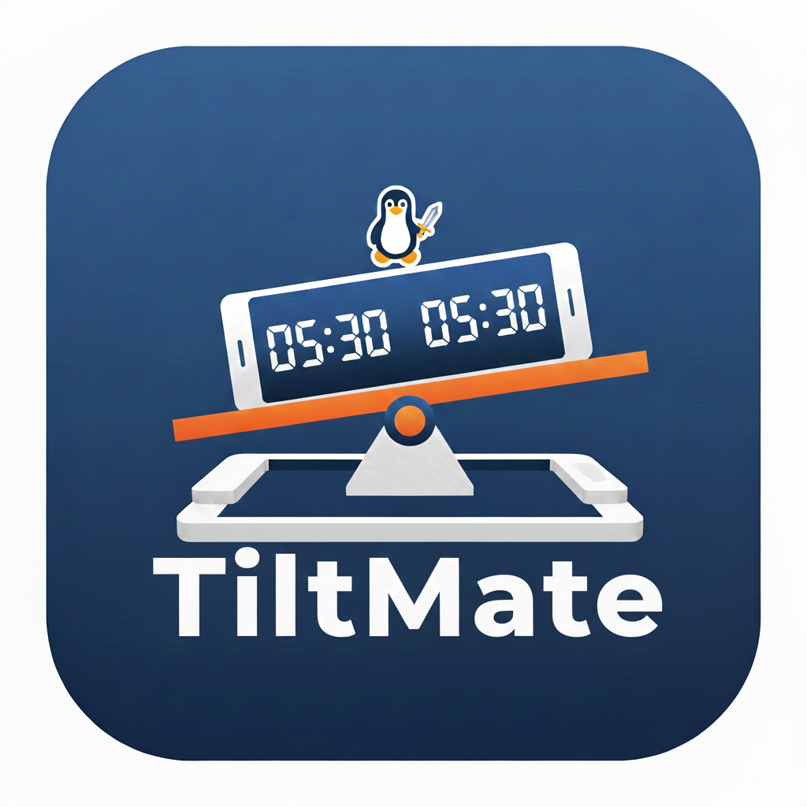

# TiltMate

[](https://github.com/linuxswords/TiltMate/actions/workflows/android-ci.yml)
[](https://github.com/linuxswords/TiltMate/releases/latest)
[](https://github.com/linuxswords/TiltMate/releases)



A chess clock! It started as a weekend project, trying to build a chess clock app based on tilting the phone :P
inspired by tempest clock.

A chess clock that works by tilting your phone. Put your phone onto something that can be tilted and instead of pressing a button on your chess clock.

There are 3D prints available and will be part of the project in the future.

## Download

📥 **[Download Latest Release](https://github.com/linuxswords/TiltMate/releases/latest)**

Download the APK and install on your Android device (Android 5.0+).

## Features

- **Tilt-based control**: Switch between clocks by tilting your phone
- **Gesture controls**:
  - Single tap to pause
  - Double tap to reset
  - Long press to access settings
- **Multiple time controls**: 3+0, 3+5, 5+0, 5+5, 10+0, 10+5, 15+0, 15+5
- **Increment support**: Fischer chess clock with increment per move
- **Clean UI**: Fullscreen, no buttons on main clock screen

## Development

**Prerequisites:** JDK 17+, Android SDK (API 21+)

```bash
# Setup
./setup-dev-env.sh          # Automated setup (Linux)
make check-env              # Verify environment

# Build
make build                  # Debug APK
make build-release          # Release APK
make install                # Build + install to device

# Test
make test                   # Unit tests
make ci                     # Full CI (test + lint + build)

# Help
make help                   # All commands
```

**Documentation:**

- [TESTING.md](TESTING.md) - Testing guide
- [RELEASE.md](RELEASE.md) - Release instructions

## ideas

- [ ] store your last time setting (profile)
- [ ] settings: add sound effects
- [ ] analog clock?
- [ ] simple tap could activate meta info like current time setting/info etc? But I like the single tap pause function
- [ ] show number of moves made

## todos

- [x] better picture
- [x] show current time setting on front screen
- [x] double tab to reset clock
- [x] avoid flickering/to-quick-switches by lowering sensibility
- [x] implement increment
- [x] fix increment bug at start
- [x] Clock-UI without buttons
- [x] use alpha instead of background change when tilting
- [x] ~~settings: configure tilting threshold~~ figured out a better way to measure tilts
