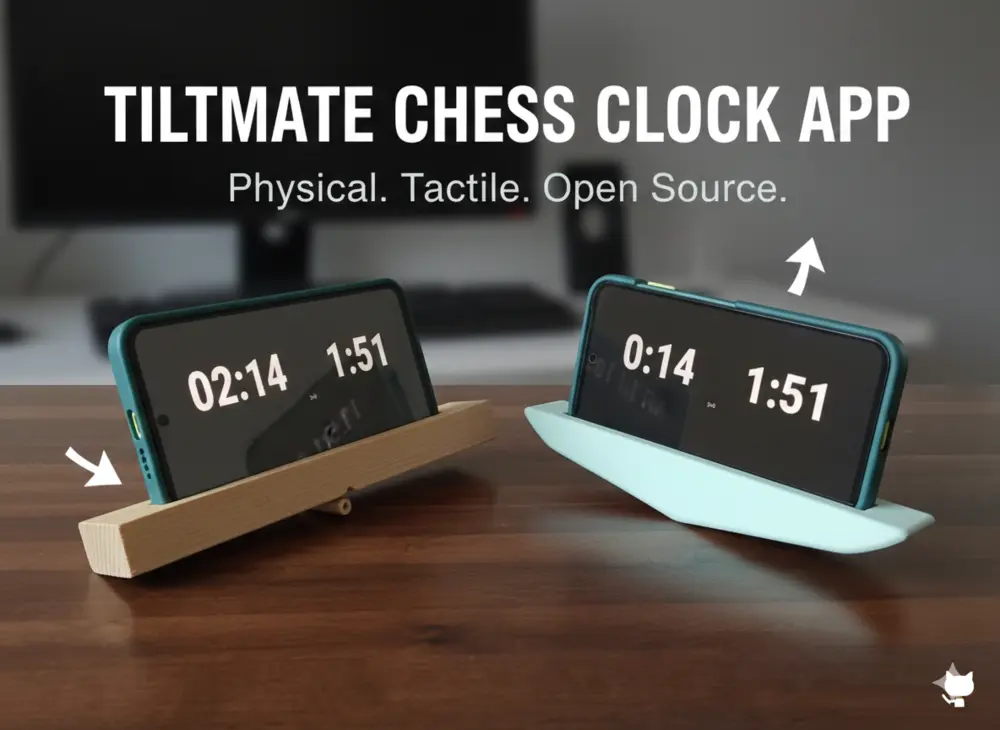
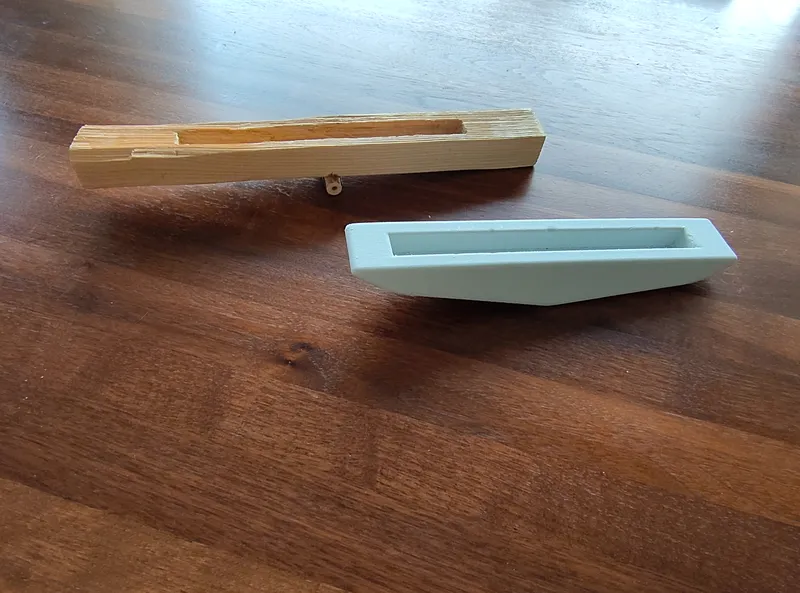

# TiltMate

[](https://github.com/linuxswords/TiltMate/actions/workflows/android-ci.yml)
[](https://github.com/linuxswords/TiltMate/releases/latest)
[](https://github.com/linuxswords/TiltMate/releases)


A chess clock! It started as a weekend project, trying to build a chess clock app based on tilting the phone :P.

Put your phone onto something that can be tilted and instead of pressing a button you tilt your phone, like a seesaw!

There are 3D prints available for the base and those will be part of the project in the future.



## Download

📥 **[Download Latest Release](https://github.com/linuxswords/TiltMate/releases/latest)**

Download the APK and install on your Android device (Android 5.0+).

## Features

- **Tilt-based control**: Switch between clocks by tilting your phone
- **Gesture controls**:
  - Single tap to pause
  - Double tap to reset
  - Long press to access settings
- **Multiple time controls**: 3+0, 3+2, 5+0, 5+3, 10+0, 10+5, 15+10, plus custom
- **Increment support**: Fischer chess clock with increment per move
- **Persistent settings**: Your time control preference is saved automatically
- **Advanced settings**:
  - Clock ticking sound (optional, disabled by default)
  - Adjustable tilt sensitivity (Low/Medium/High)
- **Clean UI**: Fullscreen, no buttons on main clock screen

## Development

**Prerequisites:** [mise](https://mise.jdx.dev), Android SDK (API 21+)

```bash
# Setup
mise install                # Installs Java 21 + Gradle 9.2.0
make check-env              # Verify environment

# Build
make build                  # Debug APK
make build-release          # Release APK
make install                # Build + install to device

# Test
make test                   # Unit tests
make ci                     # Full CI (test + lint + build)

# Help
make help                   # All commands
```

**Documentation:**

- [TESTING.md](TESTING.md) - Testing guide
- [RELEASE.md](RELEASE.md) - Release instructions
- [AAB-BUILD.md](AAB-BUILD.md) - Android App Bundle build guide

## DIY Tilt Base

Build your own seesaw-style base to use with TiltMate. The phone sits in landscape orientation and tilts like a seesaw to switch clocks.



### Requirements

- **Pivot point**: Center pivot allowing the phone to rock back and forth
- **Phone holder**: Secure the phone in landscape orientation (on its side)
- **Tilt angle**: Must allow tilting beyond the sensitivity threshold:

| Sensitivity      | Minimum Tilt Angle |
| ---------------- | ------------------ |
| High             | 3°                 |
| Medium (default) | 6°                 |
| Low              | 12°                |

### Dimensions

- **Width**: At least your phone's length + 2cm margin (typical: 20-24cm). Tipp: leave enough space bo be able to hit the base with a captured chess piece
- **Depth**: At least your phone's width + 1cm margin (typical: 8-10cm)
- **Pivot height**: 1-2cm recommended for smooth rocking motion

### Design Tips

1. **Balance**: The pivot should be centered so the base rocks evenly
2. **Stability**: Add small feet or rubber pads to prevent sliding
3. **Stop angle**: Limit tilt to ~15-20° to prevent the phone from sliding off
4. **Material**: Wood, 3D printed plastic, or even cardboard works

### 3D Printable Base

STL files for a 3D printable base will be added to this repository (see todos).

## ideas

- [ ] analog clock?
- [ ] simple tap could activate meta info like current time setting/info etc? But I like the single tap pause function

## todos

- [ ] Add example STL file for a base
- [x] better picture
- [x] store your last time setting
- [x] settings: add sound effects
- [x] show number of moves made
- [x] show current time setting on front screen
- [x] double tab to reset clock
- [x] avoid flickering/to-quick-switches by lowering sensibility
- [x] implement increment
- [x] fix increment bug at start
- [x] Clock-UI without buttons
- [x] use alpha instead of background change when tilting
- [x] ~~settings: configure tilting threshold~~ figured out a better way to measure tilts

## Credits

### Sound Effects

- **Clock Ticking Sound**: [Lux Kitchen Timer.wav](https://freesound.org/s/670889/) by [knufds](https://freesound.org/people/knufds/) - Licensed under [Creative Commons 0 (CC0)](https://creativecommons.org/publicdomain/zero/1.0/)

## Sponsor

Like the app? [](https://www.buymeacoffee.com/linuxswords)
