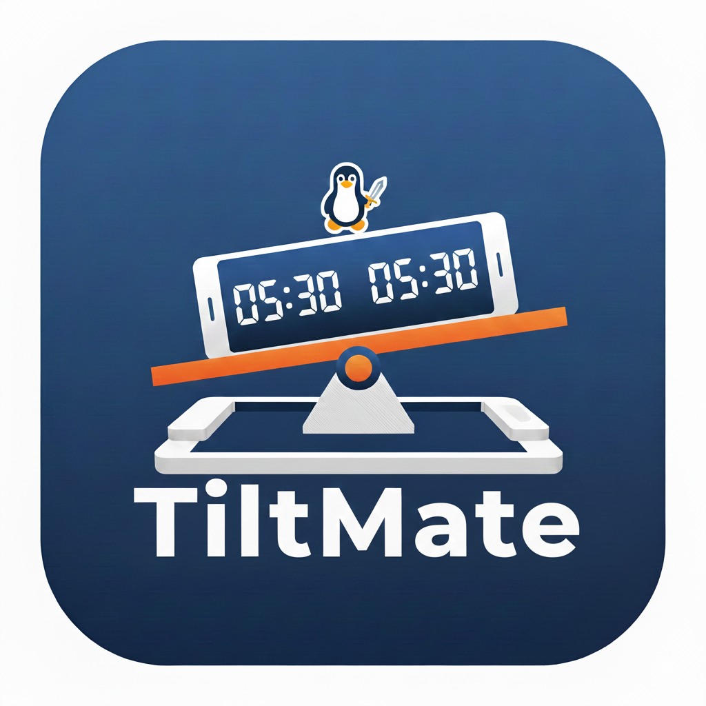
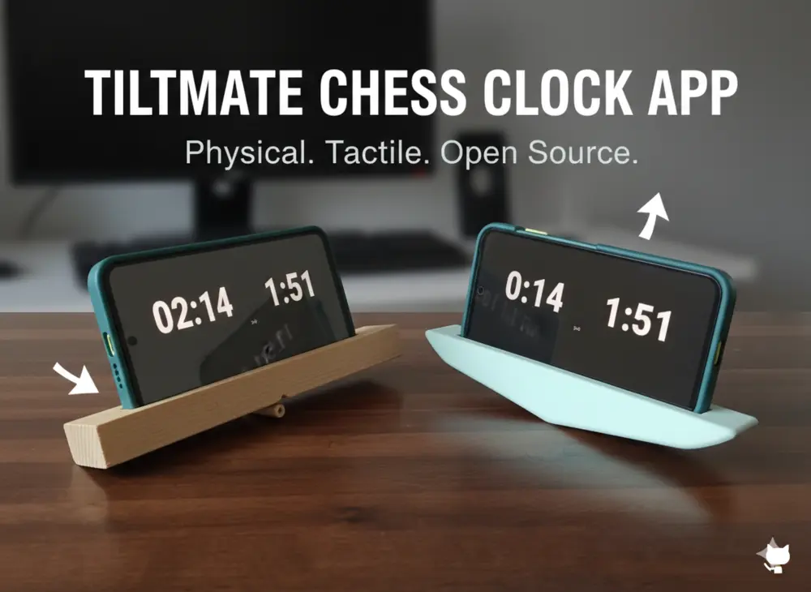
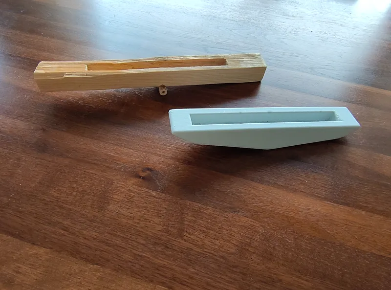

# TiltMate

[](https://github.com/linuxswords/TiltMate/actions/workflows/ci.yml)
[](https://github.com/linuxswords/TiltMate/releases/latest)



A chess clock! It started as a weekend project, trying to build a chess clock app based on tilting the phone :P.

Put your phone onto something that can be tilted and instead of pressing a button you tilt your phone, like a seesaw!

There are 3D prints available for the base: [base-models](./base-models/)



## Use it

Open the web app in your browser. On mobile, use "Add to Home Screen" to install it as a PWA — it works offline and feels like a native app.

## Features

- **Tilt-based control**: Switch between clocks by tilting your phone (accelerometer)
- **Keyboard controls**: Arrow keys to tilt, spacebar to tap, R to reset (desktop)
- **Gesture controls**:
  - Single tap to start/pause
  - Double tap to reset
  - Long press to access settings
- **Multiple time controls**: 3+0, 3+2, 5+0, 5+3, 10+0, 10+5, 15+10, plus custom
- **Increment support**: Fischer chess clock with increment per move
- **Persistent settings**: Your preferences are saved in localStorage
- **Advanced settings**:
  - Clock ticking sound (optional, disabled by default)
  - Adjustable tilt sensitivity (Low/Medium/High)
  - Move counter
  - Hint toggle
- **PWA**: Installable, offline-capable, fullscreen
- **Portrait support**: Both players can read their clock in portrait mode
- **Clean UI**: Fullscreen, no buttons on main clock screen

## Development

**Prerequisites:** [mise](https://mise.jdx.dev) or Node.js 22+

```bash
# Setup
mise install                # Installs Node.js 22
npm install                 # Install dependencies

# Build
npm run dev                 # Dev server with HMR
npm run build               # Production build (dist/)
npx tsc --noEmit            # Type check

# Or use make
make dev                    # Dev server
make ci                     # Full CI (check + build)
make help                   # All commands
```

## DIY Tilt Base

Build your own seesaw-style base to use with TiltMate. The phone sits in landscape orientation and tilts like a seesaw to switch clocks.



### Requirements

- **Pivot point**: Center pivot allowing the phone to rock back and forth
- **Phone holder**: Secure the phone in landscape orientation (on its side)
- **Tilt angle**: Must allow tilting beyond the sensitivity threshold:

| Sensitivity      | Minimum Tilt Angle |
| ---------------- | ------------------ |
| High             | 3°                 |
| Medium (default) | 6°                 |
| Low              | 12°                |

### Dimensions

- **Width**: At least your phone's length + 2cm margin (typical: 20-24cm). Tip: leave enough space to be able to hit the base with a captured chess piece
- **Depth**: At least your phone's width + 1cm margin (typical: 8-10cm)
- **Pivot height**: 1-2cm recommended for smooth rocking motion

### 3D Printable Base

STL and STEP files are available in [base-models/](./base-models/).

## Credits

### Sound Effects

- **Clock Ticking Sound**: [Lux Kitchen Timer.wav](https://freesound.org/s/670889/) by [knufds](https://freesound.org/people/knufds/) - Licensed under [Creative Commons 0 (CC0)](https://creativecommons.org/publicdomain/zero/1.0/)
## todo 

* [ ] intro should support swipe
* [ ] IOS pawn indicator is different, use dedicated pictures instead of emojis 
* [ ] IOS tilting is not working

## Sponsor

Like the app? [](https://www.buymeacoffee.com/linuxswords)
